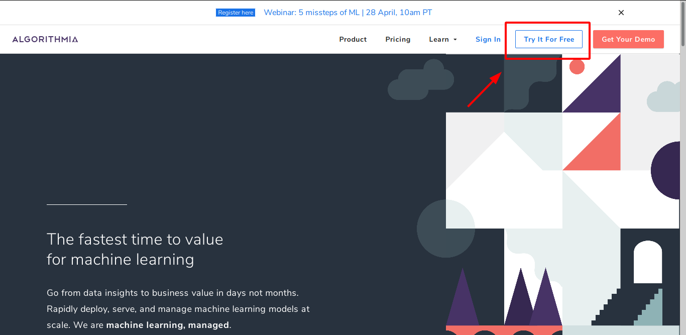
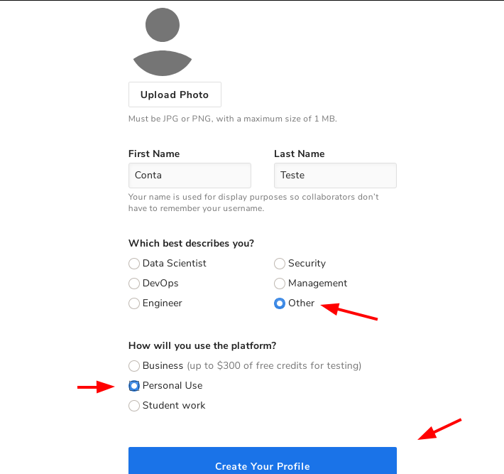
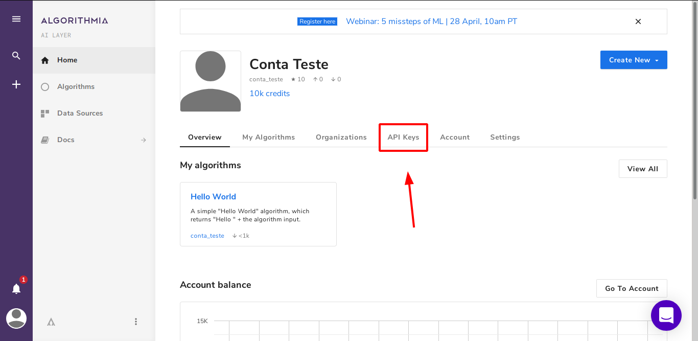
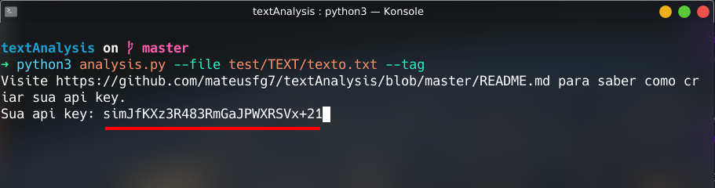
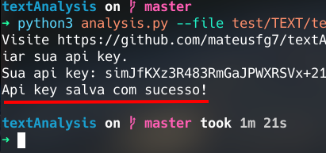
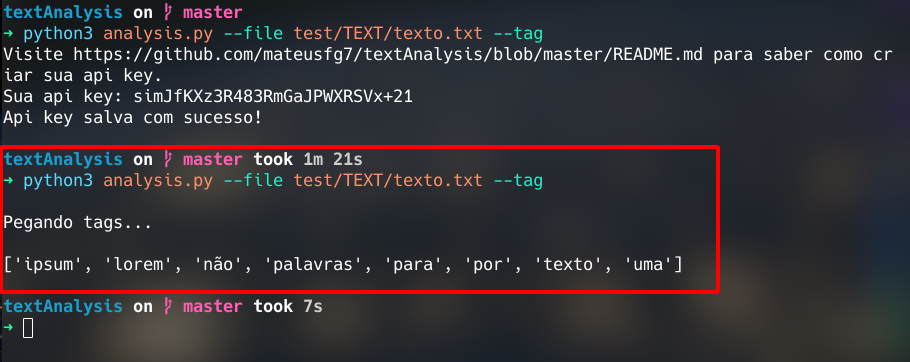

# Text Analysis :shipit:

### _Programa em python que realiza análise em texto usando recursos da API [Algorithmia](https://algorithmia.com)_

[](https://www.codefactor.io/repository/github/mateusfg7/textanalysis)

_Index_

1. [Funções](#funções)
2. [Dependências](#dependências)
    - [Arquivo de Dependências](#instale-usando-o-arquivo-de-dependências-do-python)
    - [Dependências Separadas](#instale-as-dependências-separadamente)
3. [Uso](#uso)
    - [Exêmplos de Uso](#exêmplos-de-uso)
4. [API Key](#conseguir-algorithmia-api-key)
5. [Créditos](#créditos)
6. [Doe](#doe-heart-)

---

## Funções:

-   Obter tags a partir de um texto.

-   Obter grau de sentimentos positivos, negativos e neutros.

-   Resumir um texto.

-   Obter nomes de entidades presentes no texto.

-   Obter a frequência de determinadas palavras em um texto.

-   Contar número de palavras em um texto.

## Dependências:

### _Instale usando o arquivo de dependências do Python:_

```
python3 -m pip install -r requirements.txt
```

### **Ou**

### _instale as dependências separadamente:_

**Algorithmia**

```
python3 -m pip install algorithmia
```

**GoogleTrans**

```
python3 -m pip install googletran
```

## Uso

`analysis.py --file [arquivo] [opção]`

`--tag` pegar tags

`--feeling` obter sentimentos negativos, positivos e neutros

`--summarize` resumir um texto

`--count` contar palavras

`--entity` reconhecer nomes de entidades

`--frequency` calcular a frequência das n palavras mais comuns de um texto
(`analysis.py --file [arquivo] --frequency [nº de palavras analisadas]`)

#### Exêmplos de uso:

1 - extrair tags em um texto no arquivo 'turing.txt'

_in:_

```shell
$ python3 analysis.py --file turing.txt --tag
```

_out:_

```shell
['após', 'computação', 'foi', 'para', 'pela', 'química', 'turing', 'uma']
```

2 - pegar a frequência das palavras mais comuns em um texto no arquivo 'turing.txt'

_in:_

```shell
$ python3 analysis.py --file turing.txt --frequency 5
```

_out:_

```shell
1ª Palavra mais comum: de
Frequência: 21

2ª Palavra mais comum: a
Frequência: 10

3ª Palavra mais comum: da
Frequência: 10

4ª Palavra mais comum: um
Frequência: 10

5ª Palavra mais comum: e
Frequência: 8
```

## Conseguir Algorithmia API Key

1. _Entre no site [Algorithmia.com](https://algorithmia.com) e clique em **Try it For Free**_
   
2. _Preencha as informações e crie sua conta_
   
   
3. _Clique no botão **API Keys** e copie a chave gerada automaticamente (**default-key**)_
   
   
4. _Cole sua api key e clique **enter**, se aparecer a mensagem **Api key salva com sucesso!** é porque tudo correu bem._
   
   
5. _Reexecute o script_
   

> _a api key fica salva em **auth/keys.json**_

## Créditos

-   [nlp](https://algorithmia.com/users/nlp)

    -   [AutoTag](https://algorithmia.com/algorithms/nlp/AutoTag)
    -   [SocialSentimentAnalysis](https://algorithmia.com/algorithms/nlp/SocialSentimentAnalysis)
    -   [Summarizer](https://algorithmia.com/algorithms/nlp/Summarizer)

-   [StanfordNLP](https://algorithmia.com/users/StanfordNLP)

    -   [NamedEntityRecognition](https://algorithmia.com/algorithms/StanfordNLP/NamedEntityRecognition)

-   [WebPredict (Jeff Sanchez) ](https://algorithmia.com/algorithms/WebPredict/)

    -   [WordFrequencies](https://algorithmia.com/algorithms/WebPredict/WordFrequencies)

-   [Diego Oppenheimer](https://algorithmia.com/algorithms/diego)

    -   [WordCounter](https://algorithmia.com/algorithms/diego/WordCounter)

-   [cindyxiaoxiaoli](https://algorithmia.com/users/cindyxiaoxiaoli)
    -   [EmailExtractor](https://algorithmia.com/algorithms/cindyxiaoxiaoli/EmailExtractor)

---

### Doe :heart: :

**BTC**: _13sGVSdDeVH8HVVKUDFNfrm8Q5sV7Q429o_

**ETH**: _0x0A6B9Eeb640A17bA0a0a96D986C66D0c75A39832_
